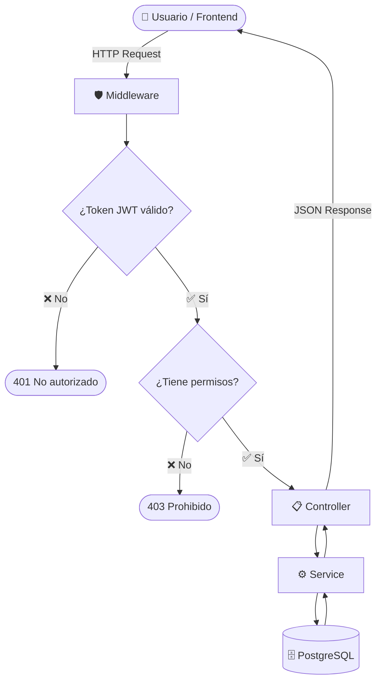
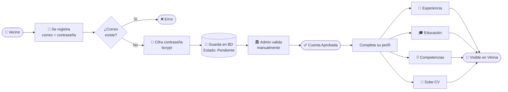
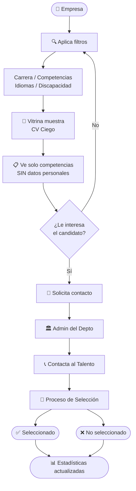
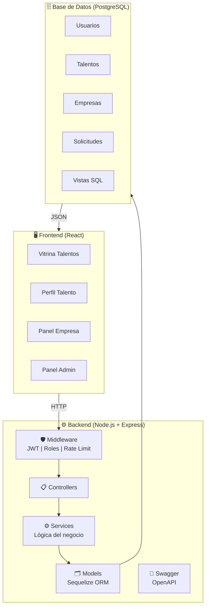
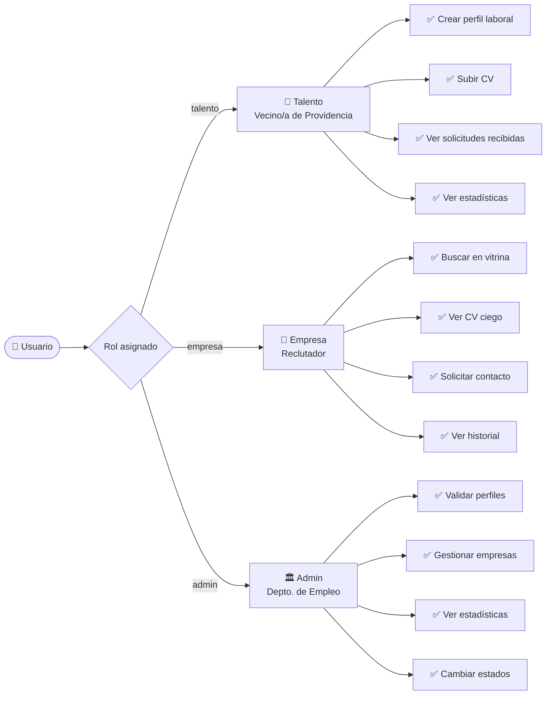
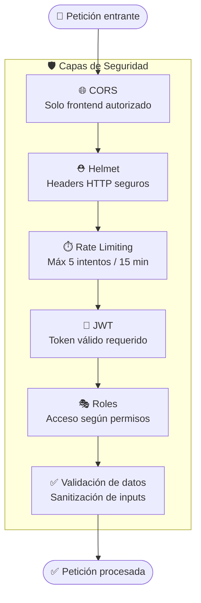

<div align="center">
  
</div>

<br/>

<div align="center">

  
  
  
  
  
  

</div>

<br/>

<div align="center">
  <h3>🚧 En desarrollo activo — Mayo 2026</h3>
  <p><em>Plataforma de búsqueda inversa de empleo para vecinos de Providencia, Chile</em></p>
</div>

<br/>

---

## 📋 Tabla de Contenidos

<div align="center">

| | Sección |
|:---:|:---|
| 01 | [¿Qué hace este proyecto?](#-qué-hace-este-proyecto) |
| 02 | [Tecnologías utilizadas](#-tecnologías-utilizadas) |
| 03 | [Estructura del proyecto](#-estructura-del-proyecto) |
| 04 | [Cómo instalar y ejecutar](#-cómo-instalar-y-ejecutar) |
| 05 | [Configuración](#-configuración-env) |
| 06 | [Módulos de la API](#-módulos-de-la-api) |
| 07 | [Flujo del sistema](#-flujo-del-sistema) |
| 08 | [Base de datos](#-base-de-datos) |
| 09 | [Roles del sistema](#-roles-del-sistema) |
| 10 | [Seguridad](#-seguridad) |
| 11 | [Pruebas](#-pruebas) |
| 12 | [Documentación](#-documentación) |
| 13 | [Equipo](#-equipo) |
| 14 | [Cliente](#-cliente) |

</div>

---

## 🎯 ¿Qué hace este proyecto?

> ProviEmplea funciona **al revés** de una bolsa de empleo tradicional.

En lugar de que los vecinos postulen a ofertas, **las empresas buscan activamente a los candidatos**. Los vecinos de Providencia crean un perfil con su experiencia, habilidades e idiomas. Las empresas pueden buscar y filtrar candidatos **sin ver su nombre, edad, género ni comuna** — solo sus competencias laborales.

Este repositorio contiene el **backend** (servidor y API REST) que alimenta la plataforma.

<br/>

---

## 🛠 Tecnologías utilizadas

<div align="center">

| Capa | Tecnología | Descripción |
|:----:|:----------:|:-----------|
| 🖥️ Servidor | **Node.js + Express 5** | Recibe y responde las peticiones del frontend |
| 🗄️ Base de datos | **PostgreSQL 14+** | Almacena toda la información del sistema |
| 🔗 ORM | **Sequelize 6** | Manejo de la base de datos sin SQL manual |
| 🔐 Autenticación | **JWT + bcryptjs** | Tokens seguros y contraseñas cifradas |
| 📄 Documentación | **Swagger / OpenAPI** | Documentación interactiva de la API |
| 📁 Archivos | **Multer** | Gestión de CVs y comprobantes |
| 🧪 Pruebas | **Jest + Supertest** | Pruebas automáticas del sistema |
| 🛡️ Seguridad | **Helmet + CORS + Rate Limit** | Protección contra ataques comunes |

</div>

<br/>

---

## 📁 Estructura del proyecto

```
backend/
├── 📂 assets/              # Logo e imágenes del proyecto
├── 📂 docs/                # Documentación (Word, SQL)
├── 📂 src/
│   ├── 📂 config/          # Configuración de base de datos y archivos
│   ├── 📂 controllers/     # Reciben las peticiones y devuelven respuestas
│   ├── 📂 docs/            # Documentación Swagger (swagger.yaml)
│   ├── 📂 middleware/      # Seguridad, roles y manejo de errores
│   ├── 📂 migrations/      # Creación de tablas en la base de datos
│   ├── 📂 models/          # Representación de las tablas de la BD
│   ├── 📂 routes/          # Rutas disponibles de la API
│   ├── 📂 seeders/         # Datos iniciales del sistema
│   ├── 📂 services/        # Lógica principal del negocio
│   ├── 📂 tests/           # Pruebas unitarias y de integración
│   ├── 📂 uploads/         # Archivos subidos por los talentos
│   ├── 📂 utils/           # Funciones de apoyo
│   ├── 📂 validators/      # Validación de datos recibidos
│   └── 📄 app.js           # Configuración Express
├── 📄 .env                 # Variables de entorno (no commiteado)
├── 📄 .env.example         # Plantilla de configuración
├── 📄 .sequelizerc         # Configuración Sequelize CLI
├── 📄 eslint.config.js     # Configuración ESLint
├── 📄 package.json
├── 📄 SECURITY.md          # Política de seguridad
└── 📄 server.js            # Punto de inicio del servidor
```

<br/>

---

## 🚀 Cómo instalar y ejecutar

### Requisitos previos

- **Node.js** versión 18 o superior
- **PostgreSQL** versión 14 o superior

### Pasos de instalación

```bash
# 1. Clonar el repositorio
git clone https://github.com/GreudyInoa/proviemplea.git
cd proviemplea/backend

# 2. Instalar dependencias
npm install

# 3. Crear el archivo de configuración
cp .env.example .env
# Abre .env y completa tus datos

# 4. Crear la base de datos
createdb proviemplea_db

# 5. Ejecutar las migraciones
npx sequelize-cli db:migrate

# 6. Cargar los datos iniciales
npx sequelize-cli db:seed:all

# 7. Iniciar el servidor en desarrollo
npm run dev
```

<br/>

---

## ⚙️ Configuración (.env)

```env
PORT=3000

DB_HOST=localhost
DB_PORT=5432
DB_NAME=proviemplea_db
DB_USER=postgres
DB_PASSWORD=tu_contraseña

JWT_SECRET=una_clave_secreta_segura
JWT_EXPIRES_IN=24h

CORS_ORIGIN=http://localhost:5173
```

<br/>

---

## 📦 Módulos de la API

<div align="center">

| Módulo | Ruta Base | Acceso | Descripción |
|:------:|:---------:|:------:|:-----------|
| 🔑 **Auth** | `/api/v1/auth` | Público | Registro e inicio de sesión |
| 👤 **Talentos** | `/api/v1/talentos` | Talento | Perfil laboral completo |
| 📚 **Perfeccionamiento** | `/api/v1/perfeccionamiento` | Talento | Cursos y certificaciones |
| 🌟 **Vitrina** | `/api/v1/vitrina` | Empresa | CV ciego de candidatos |
| 🏢 **Empresas** | `/api/v1/empresas` | Empresa | Perfil y usuarios |
| 📨 **Solicitudes** | `/api/v1/solicitudes` | Empresa/Admin | Contacto empresa→talento |
| 🛠️ **Administración** | `/api/v1/admin` | Admin | Panel del Departamento |
| 📁 **Archivos** | `/api/v1/archivos` | Talento | CVs y documentos |
| 📋 **Catálogos** | `/api/v1/catalogos` | Autenticado | Datos de referencia |

</div>

> 📖 Documentación interactiva disponible en: `http://localhost:3000/api/v1/docs`

<br/>

---

## 🔄 Flujo del sistema

### Flujo de una petición HTTP



<br/>

### Flujo de registro de un Talento



<br/>

### Flujo de búsqueda de una Empresa



<br/>

### Arquitectura general



<br/>

---

## 🗄️ Base de Datos

### Modelo Entidad-Relación

```mermaid
erDiagram
    ROLES {
        int id_rol PK
        varchar nombre
    }
    USUARIOS {
        uuid id_usuario PK
        int id_rol FK
        varchar correo
        varchar password_hash
        varchar estado_validacion
        timestamp fecha_creacion
    }
    TALENTOS {
        uuid id_talento PK
        uuid id_usuario FK
        varchar nombres
        varchar apellidos
        varchar comuna_residencia
        text resumen
        boolean discapacidad_ley21015
        boolean contratado
    }
    EMPRESAS {
        uuid id_empresa PK
        varchar rut_empresa
        varchar nombre_empresa
        int id_rubro FK
        int id_tipo_empresa FK
    }
    USUARIOS_EMPRESA {
        uuid id_usuario PK FK
        uuid id_empresa FK
        varchar nombre_completo
    }
    ANTECEDENTES_EDUCACIONALES {
        uuid id_educacion PK
        uuid id_talento FK
        varchar nivel_educacional
        varchar carrera
        varchar institucion
    }
    ANTECEDENTES_LABORALES {
        uuid id_laboral PK
        uuid id_talento FK
        varchar empresa
        varchar cargo
        date fecha_inicio
        date fecha_fin
    }
    PERFECCIONAMIENTO {
        uuid id_perfeccionamiento PK
        uuid id_talento FK
        varchar nombre_curso
        int anio_certificacion
    }
    COMPETENCIAS_TECNICAS {
        int id_competencia PK
        varchar nombre
    }
    IDIOMAS {
        int id_idioma PK
        varchar nombre
    }
    TALENTO_COMPETENCIA {
        uuid id_talento FK
        int id_competencia FK
    }
    TALENTO_IDIOMA {
        uuid id_talento FK
        int id_idioma FK
        varchar nivel_dominio
    }
    SOLICITUDES_TALENTO {
        uuid id_solicitud PK
        uuid id_empresa FK
        uuid id_talento FK
        int id_estado FK
        text notas_internas
    }
    ESTADOS_SEGUIMIENTO {
        int id_estado PK
        varchar nombre
    }

    ROLES ||--o{ USUARIOS : "tiene"
    USUARIOS ||--o| TALENTOS : "es"
    USUARIOS ||--o| USUARIOS_EMPRESA : "pertenece"
    USUARIOS_EMPRESA }o--|| EMPRESAS : "trabaja en"
    TALENTOS ||--o{ ANTECEDENTES_EDUCACIONALES : "tiene"
    TALENTOS ||--o{ ANTECEDENTES_LABORALES : "tiene"
    TALENTOS ||--o{ PERFECCIONAMIENTO : "tiene"
    TALENTOS ||--o{ TALENTO_COMPETENCIA : "tiene"
    TALENTOS ||--o{ TALENTO_IDIOMA : "habla"
    TALENTO_COMPETENCIA }o--|| COMPETENCIAS_TECNICAS : "es"
    TALENTO_IDIOMA }o--|| IDIOMAS : "es"
    EMPRESAS ||--o{ SOLICITUDES_TALENTO : "envía"
    TALENTOS ||--o{ SOLICITUDES_TALENTO : "recibe"
    ESTADOS_SEGUIMIENTO ||--o{ SOLICITUDES_TALENTO : "define"
```

<br/>

---

## 👥 Roles del sistema



<br/>

---

## 🔒 Seguridad



<div align="center">

| Medida | Descripción |
|:------:|:-----------|
| 🔐 **bcrypt** | Contraseñas cifradas, nunca en texto plano |
| 🎫 **JWT** | Token de acceso con expiración configurable |
| 🚦 **Rate Limit** | Máximo 5 intentos de login cada 15 minutos |
| 👁️ **CV Ciego** | Datos personales nunca visibles para empresas |
| 🌐 **CORS** | Solo el frontend autorizado puede conectarse |
| ⛑️ **Helmet** | Headers de seguridad HTTP automáticos |

</div>

<br/>

---

## 🧪 Pruebas

```bash
# Pruebas unitarias (sin base de datos)
npm run test:unit

# Pruebas de integración (requiere BD activa)
npm run test:integration

# Todas las pruebas
npm test
```

<div align="center">

| Tipo | Cobertura | Resultado |
|:----:|:---------:|:---------:|
| 🧩 **Unitarias** | 6 módulos | ✅ **47 pruebas pasando** |
| 🔗 **Integración** | 7 archivos | ✅ Todos los módulos |

</div>

<br/>

---

## 📚 Documentación

<div align="center">

| 📄 Documento | 📝 Descripción |
|:------------:|:--------------|
| [📘 Documentación Backend](docs/ProviEmplea_Documentacion_Backend.docx) | Arquitectura, endpoints, seguridad y pruebas |
| [📗 Documentación Base de Datos](docs/Documentacion_Base_de_Datos.docx) | Modelo de datos, vistas SQL y stored procedures |
| [📜 Script SQL](docs/script_bd_proviemplea.sql) | Script completo de creación de la base de datos |

</div>

<br/>

---

## 👨‍💻 Equipo

<div align="center">

| Nombre | Rol | Responsabilidad |
|:------:|:---:|:---------------|
| **Greudy Inoa** | 🖥️ Backend | API REST, autenticación, lógica de negocio y pruebas |
| **Nicol Orellana** | 🎨 Frontend | Interfaz de usuario en React |
| **Camila Loreto Rojo** | 🗄️ Base de Datos | Modelo de datos, vistas SQL y stored procedures |

</div>

<br/>

---

## 🏛️ Cliente

<div align="center">

**Departamento de Empleo — Municipalidad de Providencia**

| | |
|:---:|:---|
| 👤 Representantes | Solange Montaldo y Cecilia Ahumada |
| 📧 Contacto | solange.montaldo@providencia.cl |

</div>

<br/>

---

<div align="center">
  <sub>Desarrollado con ❤️ para la Municipalidad de Providencia — 2026</sub>
</div>