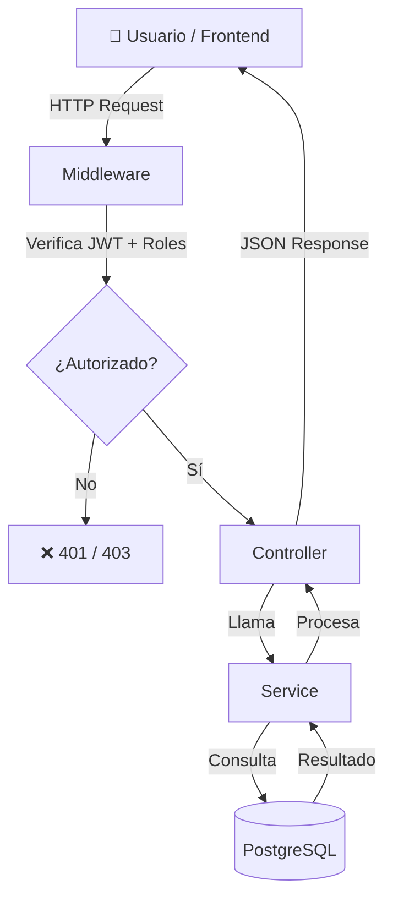
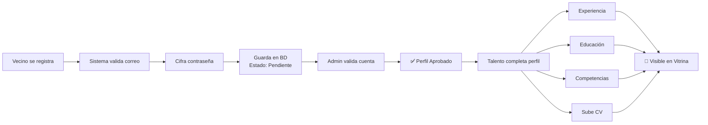
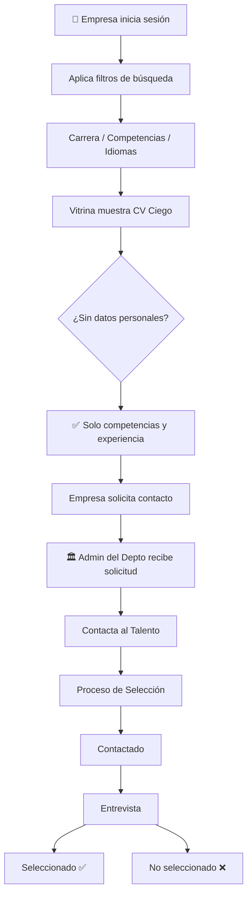
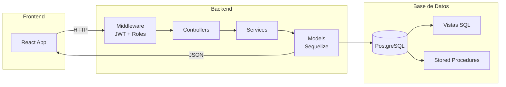
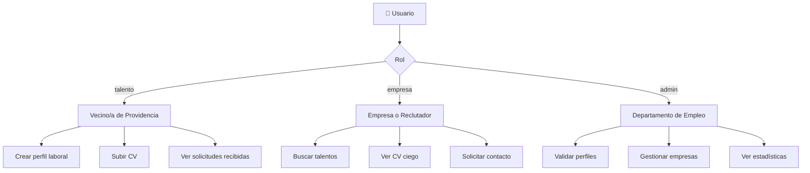
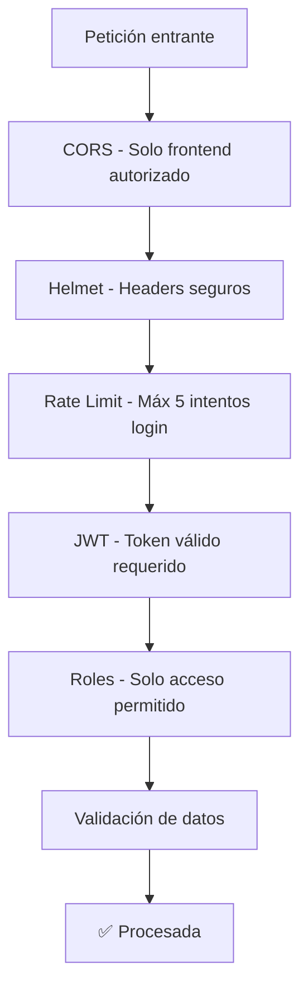

<p align="center">
  
</p>

<p align="center">
  
  
  
  
  
</p>

<p align="center">
  🚧 <strong>Estado:</strong> En desarrollo activo — Mayo 2026
</p>

---

## 📋 Tabla de Contenidos

- [¿Qué hace este proyecto?](#qué-hace-este-proyecto)
- [Tecnologías utilizadas](#tecnologías-utilizadas)
- [Estructura del proyecto](#estructura-del-proyecto)
- [Cómo instalar y ejecutar](#cómo-instalar-y-ejecutar)
- [Configuración](#configuración-env)
- [Módulos disponibles](#módulos-disponibles)
- [Flujo del sistema](#flujo-del-sistema)
- [Roles del sistema](#roles-del-sistema)
- [Documentación de la API](#documentación-de-la-api)
- [Seguridad](#seguridad)
- [Pruebas](#pruebas)
- [Documentación](#documentación)
- [Equipo](#equipo)
- [Cliente](#cliente)

---

## ¿Qué hace este proyecto?

ProviEmplea funciona al revés de una bolsa de empleo tradicional: **las empresas buscan a los candidatos**, no al revés. Los vecinos de Providencia crean un perfil con su experiencia, habilidades e idiomas. Las empresas pueden buscar y filtrar candidatos sin ver su nombre, edad, género ni comuna — solo sus competencias.

Este repositorio contiene el **backend** (servidor y API) que alimenta la plataforma.

---

## Tecnologías utilizadas

| Capa | Tecnología | Descripción |
|------|-----------|-------------|
| Servidor | Node.js + Express 5 | Recibe y responde las peticiones del frontend |
| Base de datos | PostgreSQL 14+ | Almacena toda la información del sistema |
| ORM | Sequelize 6 | Manejo de la base de datos sin SQL manual |
| Autenticación | JWT + bcryptjs | Tokens seguros y contraseñas cifradas |
| Documentación | Swagger / OpenAPI | Documentación interactiva de la API |
| Archivos | Multer | Gestión de CVs y comprobantes |
| Pruebas | Jest + Supertest | Pruebas automáticas del sistema |
| Seguridad | Helmet + CORS + Rate Limit | Protección contra ataques comunes |

---

## Estructura del proyecto

```
backend/
├── assets/              # Logo e imágenes del proyecto
├── docs/                # Documentación (Word, SQL)
├── src/
│   ├── config/          # Configuración de base de datos y archivos
│   ├── controllers/     # Reciben las peticiones y devuelven respuestas
│   ├── docs/            # Documentación Swagger (swagger.yaml)
│   ├── middleware/      # Seguridad, roles y manejo de errores
│   ├── migrations/      # Creación de tablas en la base de datos
│   ├── models/          # Representación de las tablas de la BD
│   ├── routes/          # Rutas disponibles de la API
│   ├── seeders/         # Datos iniciales del sistema
│   ├── services/        # Lógica principal del negocio
│   ├── tests/           # Pruebas unitarias y de integración
│   ├── uploads/         # Archivos subidos por los talentos
│   ├── utils/           # Funciones de apoyo
│   ├── validators/      # Validación de datos recibidos
│   └── app.js           # Configuración Express
├── .env                 # Variables de entorno (no commiteado)
├── .env.example         # Plantilla de configuración
├── .gitignore
├── .sequelizerc         # Configuración de Sequelize CLI
├── eslint.config.js     # Configuración de ESLint
├── package.json
├── SECURITY.md          # Política de seguridad
└── server.js            # Punto de inicio del servidor
```

---

## Cómo instalar y ejecutar

### Requisitos
- Node.js versión 18 o superior
- PostgreSQL versión 14 o superior

### Pasos

```bash
# 1. Clonar el repositorio
git clone https://github.com/GreudyInoa/proviemplea.git
cd proviemplea/backend

# 2. Instalar dependencias
npm install

# 3. Crear el archivo de configuración
cp .env.example .env
# Abre el archivo .env y completa tus datos

# 4. Crear la base de datos
createdb proviemplea_db

# 5. Crear las tablas
npx sequelize-cli db:migrate

# 6. Cargar los datos iniciales
npx sequelize-cli db:seed:all

# 7. Iniciar el servidor
npm run dev
```

---

## Configuración (.env)

```env
PORT=3000

DB_HOST=localhost
DB_PORT=5432
DB_NAME=proviemplea_db
DB_USER=postgres
DB_PASSWORD=tu_contraseña

JWT_SECRET=una_clave_secreta_segura
JWT_EXPIRES_IN=24h

CORS_ORIGIN=http://localhost:5173
```

---

## Módulos disponibles

| Módulo | Ruta base | Descripción |
|--------|-----------|-------------|
| Autenticación | `/api/v1/auth` | Registro e inicio de sesión |
| Talentos | `/api/v1/talentos` | Perfil laboral completo del vecino |
| Perfeccionamiento | `/api/v1/perfeccionamiento` | Cursos y certificaciones |
| Vitrina | `/api/v1/vitrina` | CV ciego para empresas |
| Empresas | `/api/v1/empresas` | Perfil y usuarios de empresa |
| Solicitudes | `/api/v1/solicitudes` | Contacto empresa → talento |
| Administración | `/api/v1/admin` | Panel del Departamento de Empleo |
| Archivos | `/api/v1/archivos` | Subida de CVs y documentos |
| Catálogos | `/api/v1/catalogos` | Datos de referencia del sistema |

---

## Flujo del sistema

### Cómo fluye una petición HTTP



### Flujo de registro de un Talento



### Flujo de búsqueda de una Empresa



### Arquitectura del sistema



---

## Roles del sistema



---

## Documentación de la API

Con el servidor en marcha, accede a la documentación interactiva en:

```
http://localhost:3000/api/v1/docs
```

---

## Seguridad



- Las contraseñas se guardan cifradas con **bcrypt**, nunca en texto plano
- Cada usuario recibe un **token JWT** al iniciar sesión
- El sistema limita los intentos de login para evitar ataques
- Los datos personales de los talentos **nunca son visibles** para las empresas

---

## Pruebas

```bash
# Pruebas unitarias (no requieren base de datos)
npm run test:unit

# Pruebas de integración (requieren base de datos activa)
npm run test:integration

# Todas las pruebas
npm test
```

| Tipo | Módulos | Resultado |
|------|---------|-----------|
| Unitarias | 6 módulos | ✅ 47 pruebas pasando |
| Integración | 7 archivos | ✅ Todos los módulos cubiertos |

---

## Documentación

| Documento | Descripción |
|-----------|-------------|
| [Documentación Backend](docs/ProviEmplea_Documentacion_Backend.docx) | Arquitectura, endpoints, seguridad y pruebas |
| [Documentación Base de Datos](docs/Documentacion_Base_de_Datos.docx) | Modelo de datos, vistas SQL y stored procedures |
| [Script SQL](docs/script_bd_proviemplea.sql) | Script completo de creación de la base de datos |

---

## Equipo

| Nombre | Responsabilidad |
|--------|----------------|
| Greudy Inoa | Desarrollo Backend |
| Nicol Orellana | Desarrollo Frontend |
| Camila Loreto Rojo | Base de Datos |

---

## Cliente

**Departamento de Empleo — Municipalidad de Providencia**  
Representantes: Solange Montaldo y Cecilia Ahumada