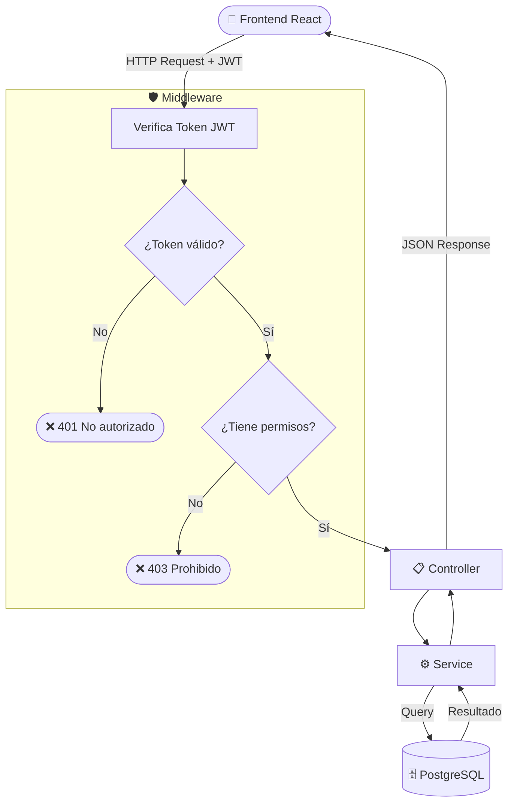
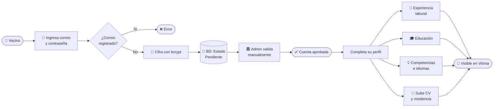
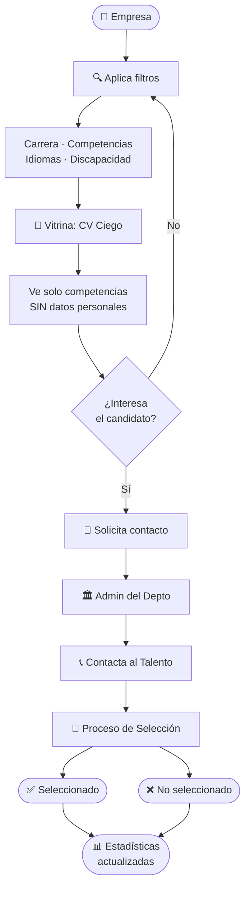
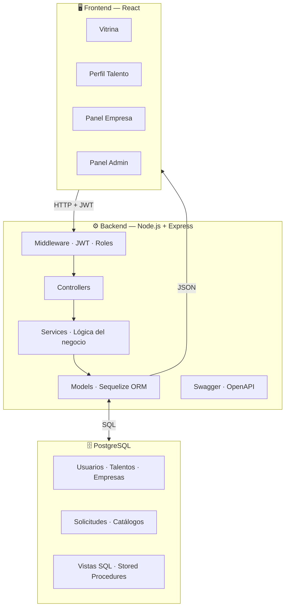
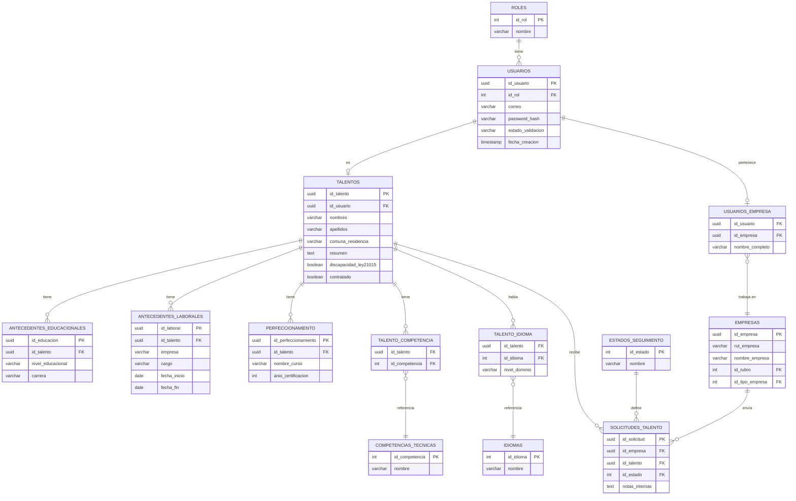
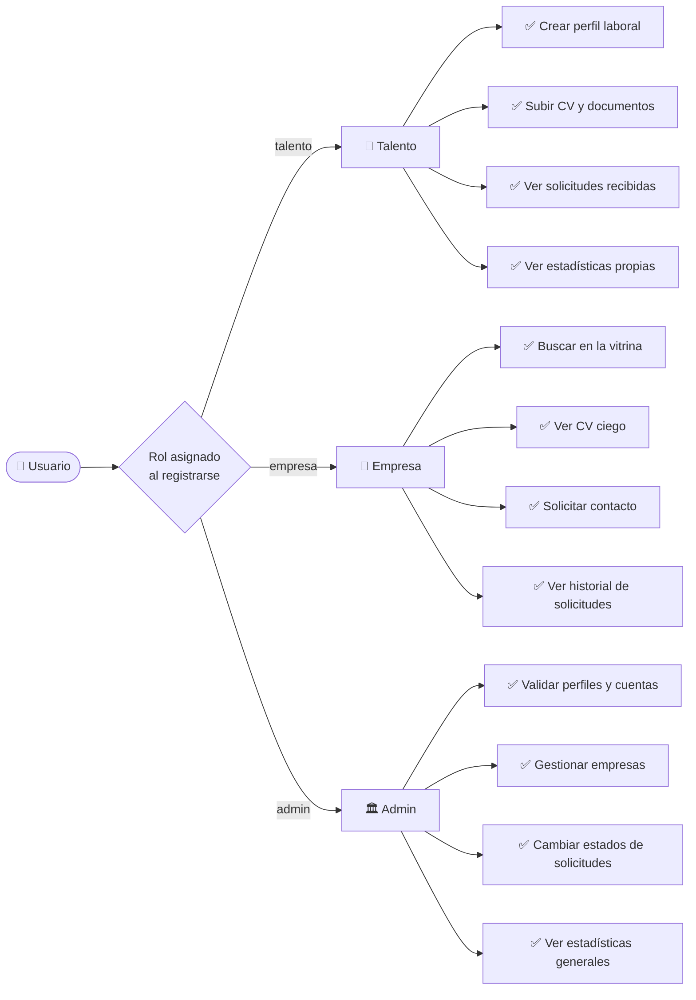
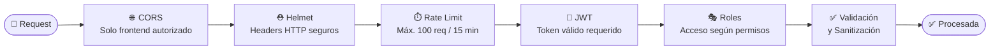

<div align="center">
  
</div>

<br/>

<div align="center">
  <a href="#"></a>
  <a href="#"></a>
  <a href="#"></a>
  <a href="#"></a>
  <a href="#"></a>
  <a href="#"></a>
  <a href="#"></a>
</div>

<br/>

<div align="center">
  <h2>🏛️ Plataforma de Búsqueda Inversa de Empleo</h2>
  <p><strong>Departamento de Empleo — Municipalidad de Providencia, Chile</strong></p>
  <p><em>Las empresas buscan a los candidatos, no al revés</em></p>
</div>

<br/>

<div align="center">

```
🚧  En desarrollo activo  ·  Mayo – Agosto 2026  ·  Fase 1
```

</div>

<br/>

---

<br/>

## 📌 Tabla de Contenidos

<br/>

<div align="center">
<table>
<tr>
<td align="center">

**Proyecto**
[¿Qué hace?](#-qué-hace-este-proyecto) · [Tecnologías](#-tecnologías) · [Estructura](#-estructura-del-proyecto)

</td>
<td align="center">

**Instalación**
[Requisitos](#-instalación) · [Pasos](#pasos) · [Variables de entorno](#-configuración-env)

</td>
</tr>
<tr>
<td align="center">

**API**
[Módulos](#-módulos-de-la-api) · [Flujos](#-flujos-del-sistema) · [Roles](#-roles-del-sistema)

</td>
<td align="center">

**Calidad**
[Base de datos](#-base-de-datos) · [Seguridad](#-seguridad) · [Pruebas](#-pruebas)

</td>
</tr>
<tr>
<td align="center" colspan="2">

**Recursos**
[Documentación](#-documentación) · [Equipo](#-equipo) · [Cliente](#-cliente)

</td>
</tr>
</table>
</div>

<br/>

---

<br/>

## 🎯 ¿Qué hace este proyecto?

<br/>

<div align="center">
<table>
<tr>
<td width="50%" align="center">

### ❌ Modelo tradicional
El candidato busca ofertas y postula a vacantes publicadas por empresas

</td>
<td width="50%" align="center">

### ✅ Modelo ProviEmplea
Las empresas buscan activamente candidatos según sus competencias

</td>
</tr>
</table>
</div>

<br/>

Los vecinos de Providencia crean un perfil con su experiencia, habilidades e idiomas. Las empresas buscan y filtran candidatos **sin ver su nombre, edad, género ni comuna** — solo sus competencias laborales.

El Departamento de Empleo actúa como **intermediario** entre empresa y candidato, garantizando transparencia y no discriminación en todo el proceso.

Este repositorio contiene el **backend** — el servidor API REST que alimenta la plataforma.

<br/>

---

<br/>

## 🛠 Tecnologías

<br/>

<div align="center">
<table>
<tr>
  <th align="center">Capa</th>
  <th align="center">Tecnología</th>
  <th align="left">Descripción</th>
</tr>
<tr>
  <td align="center">🖥️ Servidor</td>
  <td align="center"><strong>Node.js + Express 5</strong></td>
  <td>Recibe y responde las peticiones del frontend</td>
</tr>
<tr>
  <td align="center">🗄️ Base de datos</td>
  <td align="center"><strong>PostgreSQL 14+</strong></td>
  <td>Almacena toda la información del sistema</td>
</tr>
<tr>
  <td align="center">🔗 ORM</td>
  <td align="center"><strong>Sequelize 6</strong></td>
  <td>Manejo de la base de datos sin SQL manual</td>
</tr>
<tr>
  <td align="center">🔐 Auth</td>
  <td align="center"><strong>JWT + bcryptjs</strong></td>
  <td>Tokens seguros y contraseñas cifradas</td>
</tr>
<tr>
  <td align="center">📄 Docs</td>
  <td align="center"><strong>Swagger / OpenAPI</strong></td>
  <td>Documentación interactiva de la API</td>
</tr>
<tr>
  <td align="center">📁 Archivos</td>
  <td align="center"><strong>Multer</strong></td>
  <td>Gestión de CVs y comprobantes de residencia</td>
</tr>
<tr>
  <td align="center">🧪 Testing</td>
  <td align="center"><strong>Jest + Supertest</strong></td>
  <td>47 pruebas unitarias + pruebas de integración</td>
</tr>
<tr>
  <td align="center">🛡️ Seguridad</td>
  <td align="center"><strong>Helmet + CORS + Rate Limit</strong></td>
  <td>Protección contra ataques comunes</td>
</tr>
</table>
</div>

<br/>

---

<br/>

## 📁 Estructura del proyecto

<br/>

```
📦 backend/
┃
├── 📂 assets/              ← Logo e imágenes del proyecto
├── 📂 docs/                ← Documentación entregable (Word, SQL)
┃
├── 📂 src/
│   ├── 📂 config/          ← Configuración de BD y archivos
│   ├── 📂 controllers/     ← Reciben peticiones y devuelven respuestas
│   ├── 📂 docs/            ← Swagger / OpenAPI (swagger.yaml)
│   ├── 📂 middleware/      ← JWT, roles, manejo de errores
│   ├── 📂 migrations/      ← Creación de tablas (Sequelize CLI)
│   ├── 📂 models/          ← Modelos de las tablas de la BD
│   ├── 📂 routes/          ← Rutas disponibles de la API
│   ├── 📂 seeders/         ← Datos iniciales del sistema
│   ├── 📂 services/        ← Lógica del negocio
│   ├── 📂 tests/           ← Pruebas unitarias y de integración
│   ├── 📂 uploads/         ← Archivos subidos por los talentos
│   ├── 📂 utils/           ← Funciones de apoyo reutilizables
│   ├── 📂 validators/      ← Validación y sanitización de datos
│   └── 📄 app.js           ← Configuración de Express
┃
├── 📄 .env.example         ← Plantilla de variables de entorno
├── 📄 .sequelizerc         ← Configuración de Sequelize CLI
├── 📄 eslint.config.js     ← Reglas de calidad de código
├── 📄 package.json         ← Dependencias y scripts
├── 📄 SECURITY.md          ← Política de seguridad del proyecto
└── 📄 server.js            ← Punto de inicio del servidor
```

<br/>

---

<br/>

## 🚀 Instalación

<br/>

### Requisitos previos

<div align="center">

| Herramienta | Versión mínima | Descarga |
|:-----------:|:--------------:|:--------:|
| Node.js | 18.x | [nodejs.org](https://nodejs.org) |
| PostgreSQL | 14.x | [postgresql.org](https://www.postgresql.org) |
| npm | 9.x | Incluido con Node.js |

</div>

<br/>

### Pasos

```bash
# 1 · Clonar el repositorio
git clone https://github.com/GreudyInoa/proviemplea.git
cd proviemplea/backend

# 2 · Instalar dependencias
npm install

# 3 · Configurar variables de entorno
cp .env.example .env
# → Abre .env y completa los datos de tu entorno

# 4 · Crear la base de datos
createdb proviemplea_db

# 5 · Ejecutar migraciones
npx sequelize-cli db:migrate

# 6 · Cargar datos iniciales
npx sequelize-cli db:seed:all

# 7 · Iniciar servidor en desarrollo
npm run dev
```

> ✅ El servidor estará disponible en `http://localhost:3000`

<br/>

---

<br/>

## ⚙️ Configuración (.env)

<br/>

```env
# ── Servidor ──────────────────────────────
PORT=3000

# ── Base de Datos ─────────────────────────
DB_HOST=localhost
DB_PORT=5432
DB_NAME=proviemplea_db
DB_USER=postgres
DB_PASSWORD=tu_contraseña

# ── Autenticación ─────────────────────────
JWT_SECRET=una_clave_secreta_muy_segura
JWT_EXPIRES_IN=24h

# ── CORS ──────────────────────────────────
CORS_ORIGIN=http://localhost:5173
```

<br/>

---

<br/>

## 📦 Módulos de la API

<br/>

<div align="center">
<table>
<tr>
  <th align="center">Módulo</th>
  <th align="center">Ruta Base</th>
  <th align="center">Acceso</th>
  <th align="left">Descripción</th>
</tr>
<tr>
  <td align="center">🔑 Auth</td>
  <td align="center"><code>/api/v1/auth</code></td>
  <td align="center">Público</td>
  <td>Registro e inicio de sesión</td>
</tr>
<tr>
  <td align="center">👤 Talentos</td>
  <td align="center"><code>/api/v1/talentos</code></td>
  <td align="center">Talento</td>
  <td>Perfil laboral completo del vecino</td>
</tr>
<tr>
  <td align="center">📚 Perfeccionamiento</td>
  <td align="center"><code>/api/v1/perfeccionamiento</code></td>
  <td align="center">Talento</td>
  <td>Cursos y certificaciones</td>
</tr>
<tr>
  <td align="center">🌟 Vitrina</td>
  <td align="center"><code>/api/v1/vitrina</code></td>
  <td align="center">Empresa</td>
  <td>CV ciego de candidatos</td>
</tr>
<tr>
  <td align="center">🏢 Empresas</td>
  <td align="center"><code>/api/v1/empresas</code></td>
  <td align="center">Empresa</td>
  <td>Perfil empresarial y usuarios</td>
</tr>
<tr>
  <td align="center">📨 Solicitudes</td>
  <td align="center"><code>/api/v1/solicitudes</code></td>
  <td align="center">Empresa / Admin</td>
  <td>Solicitudes de contacto empresa→talento</td>
</tr>
<tr>
  <td align="center">🛠️ Admin</td>
  <td align="center"><code>/api/v1/admin</code></td>
  <td align="center">Admin</td>
  <td>Panel del Departamento de Empleo</td>
</tr>
<tr>
  <td align="center">📁 Archivos</td>
  <td align="center"><code>/api/v1/archivos</code></td>
  <td align="center">Talento</td>
  <td>Subida de CVs y documentos</td>
</tr>
<tr>
  <td align="center">📋 Catálogos</td>
  <td align="center"><code>/api/v1/catalogos</code></td>
  <td align="center">Autenticado</td>
  <td>Competencias, idiomas, rubros y rangos</td>
</tr>
</table>
</div>

<br/>

> 📖 **Documentación interactiva:** `http://localhost:3000/api/v1/docs`

<br/>

---

<br/>

## 🔄 Flujos del sistema

<br/>

### Flujo de una petición HTTP



<br/>

### Registro de un Talento



<br/>

### Búsqueda de candidatos por una Empresa



<br/>

### Arquitectura general



<br/>

---

<br/>

## 🗄️ Base de Datos

<br/>

### Diagrama Entidad-Relación



<br/>

---

<br/>

## 👥 Roles del sistema

<br/>



<br/>

---

<br/>

## 🔒 Seguridad

<br/>



<br/>

<div align="center">
<table>
<tr>
  <th align="center">Medida</th>
  <th align="left">Descripción</th>
</tr>
<tr>
  <td align="center">🔐 <strong>bcrypt</strong></td>
  <td>Contraseñas cifradas con salt, nunca en texto plano</td>
</tr>
<tr>
  <td align="center">🎫 <strong>JWT</strong></td>
  <td>Token de acceso con expiración de 24 horas</td>
</tr>
<tr>
  <td align="center">🚦 <strong>Rate Limit</strong></td>
  <td>Máximo 100 peticiones cada 15 minutos por IP</td>
</tr>
<tr>
  <td align="center">👁️ <strong>CV Ciego</strong></td>
  <td>Nombre, edad, género y comuna nunca visibles para empresas</td>
</tr>
<tr>
  <td align="center">🌐 <strong>CORS</strong></td>
  <td>Solo el frontend autorizado puede conectarse al backend</td>
</tr>
<tr>
  <td align="center">⛑️ <strong>Helmet</strong></td>
  <td>Headers de seguridad HTTP configurados automáticamente</td>
</tr>
<tr>
  <td align="center">🔍 <strong>ESLint Security</strong></td>
  <td>Análisis estático de código para detectar vulnerabilidades</td>
</tr>
</table>
</div>

<br/>

---

<br/>

## 🧪 Pruebas

<br/>

```bash
# Pruebas unitarias — no requieren base de datos
npm run test:unit

# Pruebas de integración — requieren BD activa
npm run test:integration

# Todas las pruebas
npm test
```

<br/>

<div align="center">
<table>
<tr>
  <th align="center">Tipo</th>
  <th align="center">Módulos cubiertos</th>
  <th align="center">Resultado</th>
</tr>
<tr>
  <td align="center">🧩 <strong>Unitarias</strong></td>
  <td align="center">AuthService · EmpresaService · TalentoService<br/>VitrinaService · SolicitudService · PerfeccionamientoService</td>
  <td align="center">✅ <strong>47 / 47 pasando</strong></td>
</tr>
<tr>
  <td align="center">🔗 <strong>Integración</strong></td>
  <td align="center">7 archivos · Todos los módulos principales</td>
  <td align="center">✅ Cubiertos</td>
</tr>
</table>
</div>

<br/>

---

<br/>

## 📚 Documentación

<br/>

<div align="center">
<table>
<tr>
  <th align="center">Documento</th>
  <th align="left">Descripción</th>
</tr>
<tr>
  <td align="center">📘 <a href="docs/ProviEmplea_Documentacion_Backend.docx"><strong>Documentación Backend</strong></a></td>
  <td>Arquitectura, módulos, endpoints, seguridad y pruebas</td>
</tr>
<tr>
  <td align="center">📗 <a href="docs/Documentacion_Base_de_Datos.docx"><strong>Documentación Base de Datos</strong></a></td>
  <td>Modelo de datos, índices, vistas SQL y stored procedures</td>
</tr>
<tr>
  <td align="center">📜 <a href="docs/script_bd_proviemplea.sql"><strong>Script SQL</strong></a></td>
  <td>Script completo de creación de la base de datos PostgreSQL</td>
</tr>
</table>
</div>

<br/>

---

<br/>

## 👨‍💻 Equipo

<br/>

<div align="center">
<table>
<tr>
  <td align="center" width="33%">
    <br/>
    <h3>Greudy Inoa</h3>
    <p>🖥️ <strong>Backend Developer</strong></p>
    <p><em>API REST · Autenticación · Lógica de negocio · Pruebas · Swagger</em></p>
  </td>
  <td align="center" width="33%">
    <br/>
    <h3>Nicol Orellana</h3>
    <p>🎨 <strong>Frontend Developer</strong></p>
    <p><em>Interfaz de usuario en React · Consumo de la API</em></p>
  </td>
  <td align="center" width="33%">
    <br/>
    <h3>Camila Loreto Rojo</h3>
    <p>🗄️ <strong>Base de Datos</strong></p>
    <p><em>Modelo de datos · Vistas SQL · Stored Procedures</em></p>
  </td>
</tr>
</table>
</div>

<br/>

---

<br/>

## 🏛️ Cliente

<br/>

<div align="center">

<h3>Departamento de Empleo<br/>Municipalidad de Providencia</h3>

<table>
<tr>
  <td align="center">👤 <strong>Representantes</strong></td>
  <td>Solange Montaldo Romero · Cecilia Ahumada Vásquez</td>
</tr>
<tr>
  <td align="center">📧 <strong>Contacto</strong></td>
  <td>solange.montaldo@providencia.cl · cecilia.ahumada@providencia.cl</td>
</tr>
<tr>
  <td align="center">📅 <strong>Período</strong></td>
  <td>Mayo — Agosto 2026</td>
</tr>
</table>

</div>

<br/>

---

<div align="center">
  <br/>
  <sub>Desarrollado con ❤️ para la Municipalidad de Providencia — 2026</sub>
  <br/><br/>
</div>